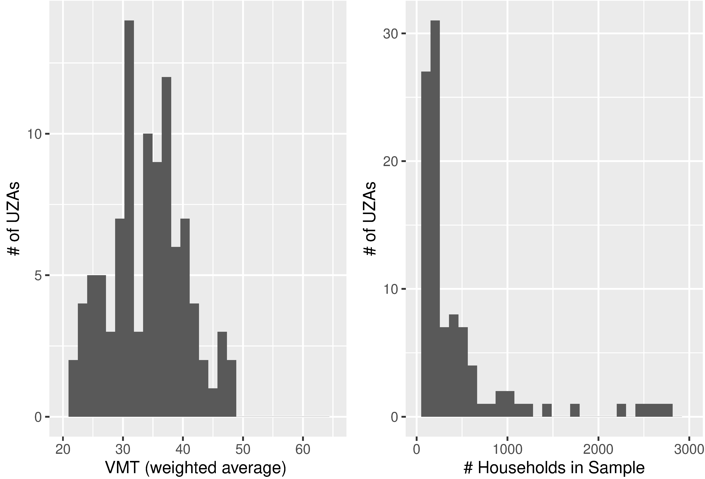
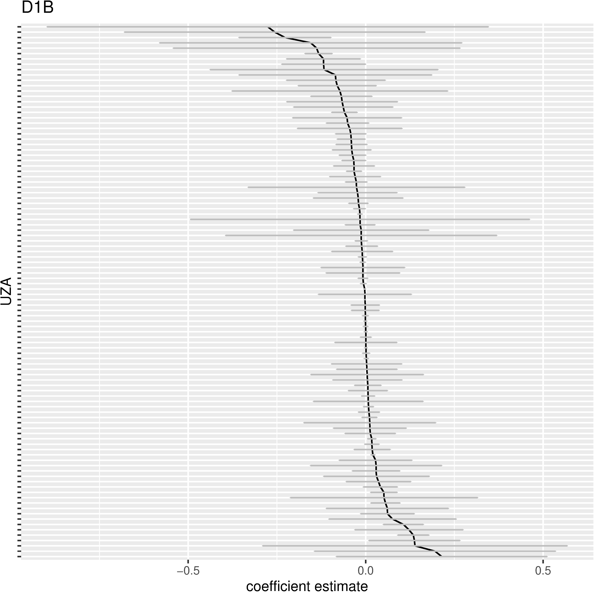
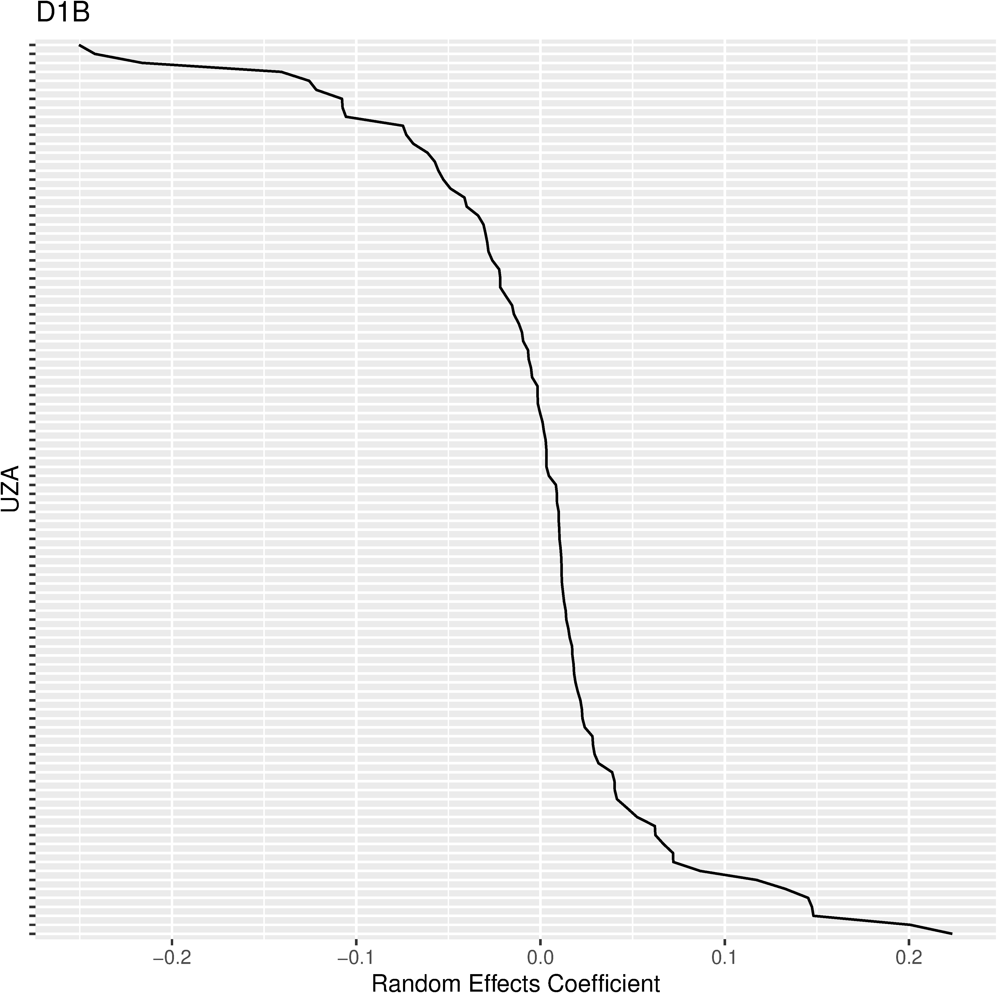

```{r setup, include=T, echo=F}
knitr::opts_knit$set(root.dir = "./")
knitr::opts_chunk$set(message=FALSE, warning=F, echo=F)
#options(width = 2000)
#options(repos="https://cran.rstudio.com")
```

# Motivation and Research Questions

- Numerous previous studies focusing on producing point estimates of effects (elasticities) and ended up with a wide range of estimates for the elasticity of the built environment on travel outcomes. 
  - For example, In the papers reviewed in Ewing & Cervero (2010), estimates for elasticity of Vehicle Miles Traveled with respect to population density range from -1.05 to +0.03 (with weighted average=-0.04)

- How do we reconcile these different estimates? 
  - Most previous studies use data from a single region, collected by different agencies
  - Used different models, sometimes with different dependent/independent variables
  - Regional variation?

???
None of the research reviewed by Ewing & Cervero followed reproducible research practice, so they had to extract the point estimates from each papers and synthesizes those estimates in their meta analysis to come up with the weighted average

---

# Data and Methods

- Data used including the 2009 U.S. National Household Travel Survey (NHTS) and high- resolution built environment measures from the EPA Smart Location Database (SLD)
  - NHTS Socio-demographic characteristics
  - NHTS Travel behavior outcomes, including household VMT on survey day
  - SLD Diverse set of built environment measures organized by 5D variables

- Include 44,000 households across 100 UZAs

---

# Descriptives

```{r uza-hist, out.height="40%", out.width="95%", fig.cap="Histograms of UZA-level weighted average VMT and Number of household obser- vations by UZA", fig.align="center"}

```

---

# Methods/Models

- Fixed Effects Models

$$\begin{equation}\begin{split}\Pr(VMT_{iu}=0) = \frac{\exp(V_{iu})}{1 + \exp(V_{iu})}, \\ \text{where } V_{iu} = \alpha_{u} + \beta X_{iu}^{SES} + \gamma_u X_{iu}^{BE}\end{split}\end{equation}$$
$$\begin{equation}\log(VMT_{iu}) \sim N(a_{u} + b X_{iu}^{SES} + c_u X_{iu}^{BE}, \sigma) \\ \text{ for } VMT_{iu} > 0\end{equation}$$

- Hierarchical Mixed Effect Models

$$\begin{equation}\begin{split}V_{iu} = \alpha_{iu} + \beta X_{iu}^{SES} + \gamma_{iu} X_{iu}^{BE}, \\ \text{where } \alpha_{iu} \sim N(\bar{\alpha}, \sigma_{\alpha}), \\ \text{and } \gamma_{iu} \sim N(\bar{\gamma}, \Sigma_{\gamma}) \end{split} \end{equation}$$

$$\begin{equation} \begin{split} VMT_{iu} \sim N(a_{iu} + b X_{iu}^{SES} + c X_{iu}^{BE}, \sigma), \\ \text{where } a_{iu} \sim N(\bar{a}, \sigma_{a}), \\ \text{and } c_{iu} \sim N(\bar{c}, \Sigma_{c}) \end{split} \end{equation}$$

---

# Findings (1)

.pull-left-30[
- For the elasticity estimate of VMT wrt population density (D1B) = **-0.086** in pooled fixed effect model, in line with Ewing & Cervero’s estimate of -0.04
- Likelihood ratio test rejects the fixed effect model (no UZA-specific slopes) and favors the full fixed effect model with UZA-specific coefficient ( $\chi^2$=1620.883, p < 0.000), although most UZA-specific coefficients are not significant.
]

.pull-right-70[
```{r fixed, out.height="90%", out.width="90%", fig.cap="Point estimates and confidence intervals for D1B (population density) variable by UZA", fig.align='center'}

```
]

---

# Findings (2)

.pull-left-30[
- Likelihood ratio test also favors full mixed effect model with both random slopes and intercepts (p<0.0000).
- Notably, in the mixed effect model, all fixed effect coefficients for 5D variables are not significant.
]

.pull-right-70[
```{r mixed, out.height="90%", out.width="90%", fig.cap="Random coefficients for D1B variable by UZA", fig.align='center'}

```
]

---

# Conclusions and Discussion

## Conclusions 
- Significant regional variation in the estimates of built-environment effects on VMT, even as the mean estimate in line with synthesized weighted average
- With NHTS and SLD data, estimates of UZA-specific effect are mostly unusable (highly variable and statistically insignificant)
- Mixed-effect model provides a solution to the problem by allowing partial pooling
- After considering random effects, there is no statistically significant fixed effects.

## Implications
- Maybe we should not have been so fixated with producing a single estimate after all?
- Both sides of the debate miss some part of the big picture

---

# Experience on Reproducible Research

- The work conducted for the project using R and the `tidyverse` suite of packages, reproducible from raw data to final products

- Project reports and papers written using RMarkdown
  - including my TRB paper and the RMarkdown is available at https://github.com/cities/nhts-mxlm
  
- Product of the project including an open source R package `VETravelDemandMM` (https://github.com/cities-lab/VETravelDemandMM) contributed to the VisionEval project (https://visioneval.org), a strategic planning model under active development led by FHWA.

---

# Tidy workflow and R for Reproducible Research


Credit: [Wickham and Grolemund, 2023](https://r4ds.hadley.nz/)

---

# Reflections on Reproducible Research

- Personally, I cannot imagine (myself) doing research any other way; "You have at least one collaborator for any project - at the very least, yourself in 3 months".

- Making code available can only go so far; live documentation and literal programming is an essential, but often neglected, step in reproducible research.

- Tools (in R, Python) supporting reproducible research have improved tremendously over the last a few years, but the learning curve is still steep and most students and researchers have not been trained or exposed in reproducible research.

- Combining reproducible research with open data facilitates dissemination of research and speeds up scientific investigation

---

# Questions + Acknowledgements


Liming Wang, PhD <br>
Associate Professor <br>
Toulan School of Urban Studies and Planning<br>
Portland State University<br>
lmwang@pdx.edu<br>
<br>
<br>
<br>
<br>
<br>
<br>

Partial financial support from NITC-1433 and ODOT SPR-788 is appreciated and acknowledged.

```{r, echo=FALSE,out.width="30%", out.height="30%",fig.show='hold', fig.align='center'}
knitr::include_graphics(c("figs/NITC.jpg", "figs/ODOT.jpg"))
```